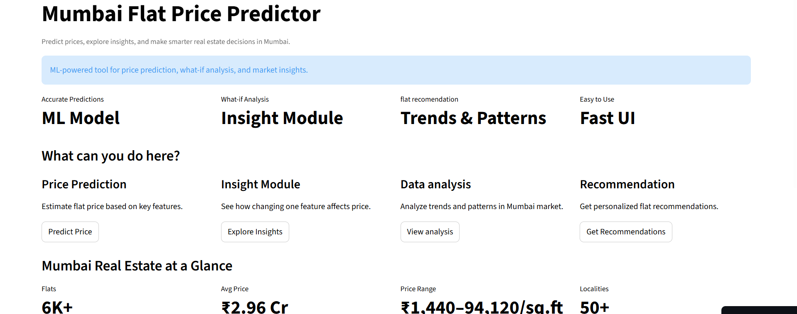
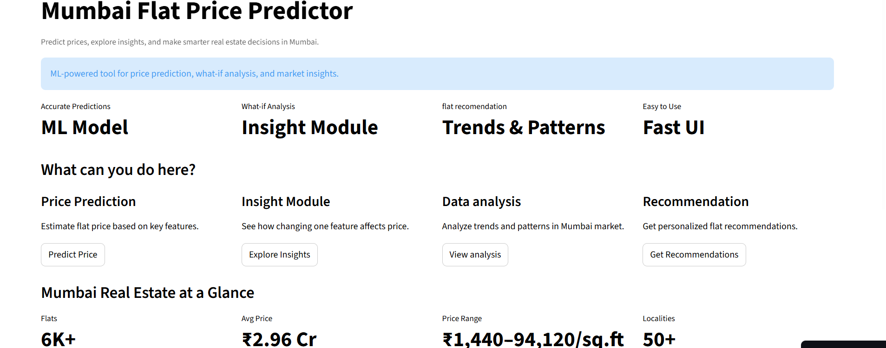
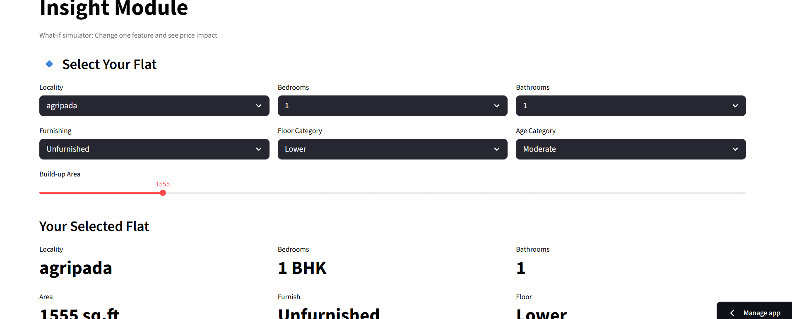
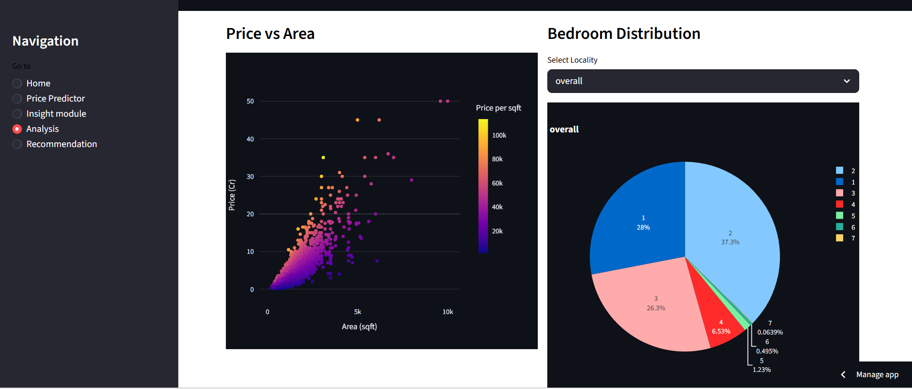
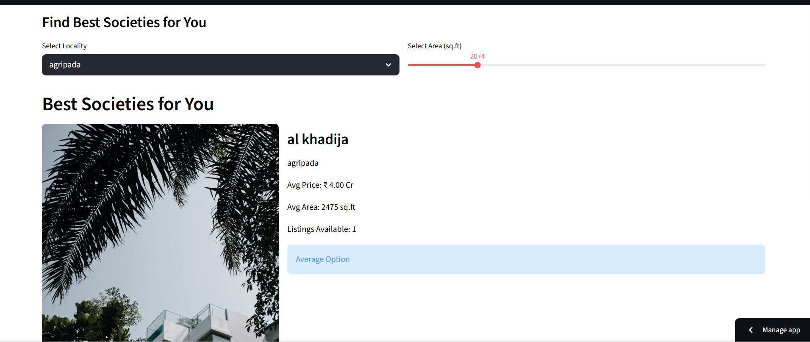

Mumbai House Price Prediction App

https://mumbai-flats-prediction.streamlit.app

Project Overview

An end-to-end machine learning web application for predicting Mumbai flat prices and analyzing real estate trends.

The application includes:
- Price prediction
- Insight module
- Recommendation engine
- Interactive visualizations
- Market analysis dashboard

Price Prediction
Predict property prices using ML models.

Insight Module
Perform what-if analysis by changing property features.

Recommendation System
Get similar society recommendations.

Data Analysis
Analyze trends using maps and charts.

Used Libraries 
- Python
- Streamlit
- Pandas
- NumPy
- Scikit-learn
- XGBoost
- Plotly
- Matplotlib

 Deployment

Deployed using Streamlit Community Cloud and GitHub integration.

## Screenshots

### Home Page

### Price Prediction

### Insight Module

### Analysis Dashboard

### Recommendation System

